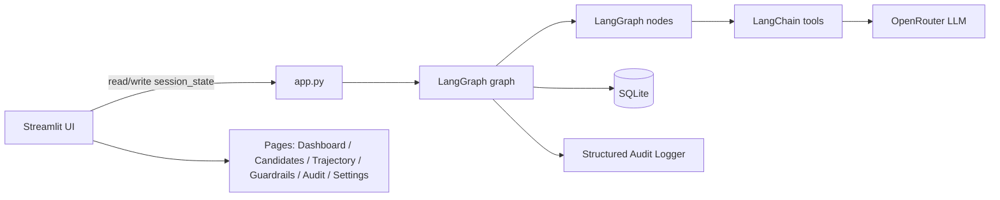

# TechVest Recruitment Agent (LangGraph + Streamlit)

Enterprise recruitment dashboard that evaluates candidates using an autonomous **LangGraph** workflow with **prompt-injection defense**, **fairness validation**, **human approval gating**, and **persistent audit logging**.

## Features

- **Autonomous LangGraph pipeline**
  - Plan → Parse Resume → Score Candidate → Guardrails (injection + fairness + safety limits) → Decision → Human Approval Gate → Availability → Scheduler → Audit → Finish
- **Tools (LangChain tools)**
  - `parse_resume`
  - `score_candidate`
  - `check_availability`
  - `propose_interview`
  - plus:
    - `fairness_check`
    - `prompt_injection_detector`
- **Prompt injection defense**
  - Regex pre-scan + sanitisation
  - Red/highlighted UI messaging when attacks are detected
- **Fairness validation**
  - Rule-based bias checks (gender, religion, age, college prestige, evidence consistency)
  - PASS/FAIL + bias score
- **Human approval gate**
  - Graph interrupts before scheduling interviews
  - Streamlit “Approve & Schedule” / “Reject Scheduling”
- **Persistent audit & trajectory**
  - SQLite persistence for run data, trajectory events, decisions, guardrail events, audit logs
  - Trajectory visualisation page
- **Enterprise-style UI**
  - Dark mode, glassmorphism panels, Plotly charts, glass KPI cards

## Tech Stack

- Python 3.11+
- Streamlit
- LangGraph (NOT CrewAI)
- LangChain
- OpenRouter API
- GPT-4o Mini (default)
- Pydantic v2
- Pandas
- Plotly
- SQLite
- python-dotenv

## Architecture

### Flow diagram (high level)

```mermaid
flowchart TD
  A[Start] --> B[plan_node]
  B -->|parse_resume| C[parse_resume_node]
  C --> D[score_candidate_node]
  D --> E[guardrail_node]
  E --> F[decision_node]
  F --> G[human_approval_node\n(Interrupt)]
  G -->|approved| H[availability_node]
  H --> I[scheduler_node]
  I --> J[audit_node]
  J --> K[finish_node\nEND]
  G -->|rejected| K
```

### Architecture diagram



## Installation

### 1) Create a virtual environment

```bash
python -m venv .venv
./.venv/Scripts/activate
```

### 2) Install dependencies

```bash
pip install -r requirements.txt
```

### 3) Configure environment variables

1. Copy the template:

```bash
copy .env.example .env
```

2. Fill in your `OPENROUTER_API_KEY`.

## Running the app

```bash
streamlit run app.py
```

Open the printed local URL in your browser.

## Usage

1. Upload a **Job Description**.
2. Upload one or more **resumes** (PDF or TXT). If none are uploaded, the app uses sample data.
3. Click **Run Agent**.
4. When scoring completes, the agent pauses for **human approval** before scheduling.
5. Review recommendations, trajectory, guardrails, and audit logs from the pages.

## Screenshots

> Place screenshots here (dashboard, candidate card view, trajectory, guardrails, audit, settings) as you iterate.

## Testing

Run all unit tests:

```bash
pytest -q
```

Test categories (after `tests/` is added):
- prompt injection detection tests
- fairness validation tests
- scheduler tests
- LangGraph interrupt / termination tests

## Notes

- This project stores data locally in the configured SQLite database path.
- Always review injection detections and fairness PASS/FAIL before acting on scheduling.

